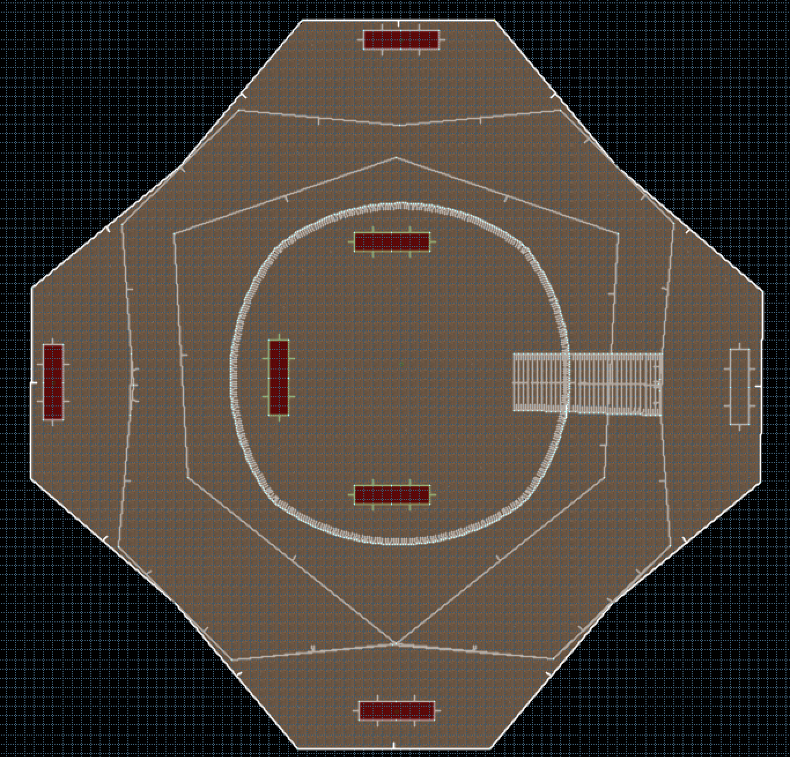
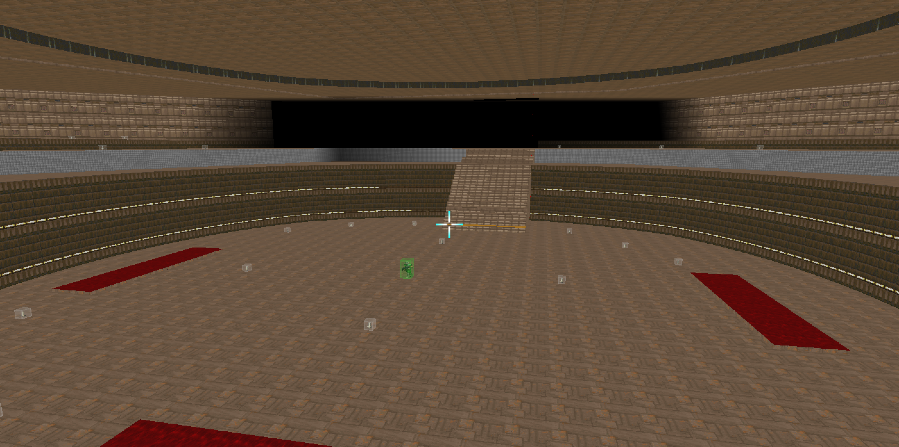
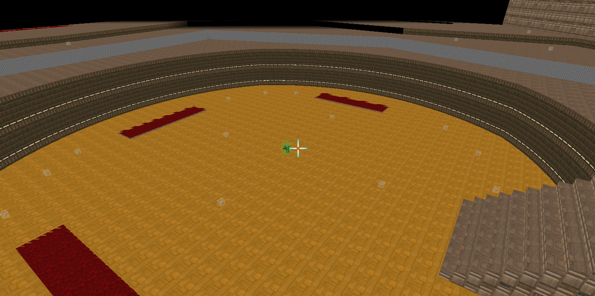
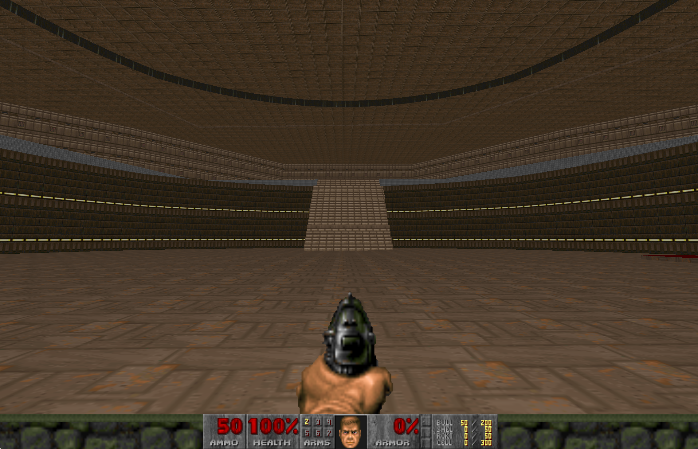
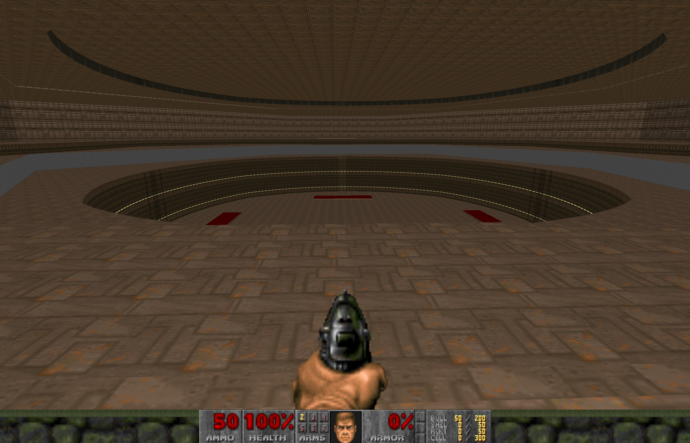

# ConNquestEnv: Обертка над VizDoom с поддержкой обучения по волнам

## Описание

`ConNquestEnv` — это Python-обертка над VizDoom, предназначенная для обучения агента по нарастающей сложности. Агент начинается в яме (`near`-зона) и сражается с волнами врагов, каждая из которых генерируется динамически по набору правил.

Цель — обеспечить постепенное обучение навыкам выживания и боя, начиная с простейших ситуаций (враги с малым HP, оружие в зоне старта) и двигаясь к сложным комбинациям.

## Как это работает

Каждая волна генерируется при вызове `spawn_wave()`. Алгоритм:

1. **Определение текущего уровня сложности (tier)** на основе номера волны.
2. **Выбор врагов**:
   - Объединяются все враги от tier 1 до текущего.
   - Используется взвешенное случайное распределение — враги последнего доступного tier получают больший вес (`tier_bonus`).
   - Выбор без повторов.
3. **Проверка урона**:
   - Суммируется HP всех врагов.
   - Оценивается минимальный возможный урон от всех выдаваемых оружий и патронов (через `min_damage * packs`).
   - Если урона недостаточно, добавляется `extra_ammo_type` в количестве, покрывающем дефицит (`extra_pack_damage`).
4. **Спавн**:
   - Враги размещаются на `far` точках (доступ постепенно расширяется).
   - Оружие и патроны — в `ring` и `near` зонах.
   - Хил и броня спавнятся каждые `health_interval` волн.
   - Каждые `backpack_interval` волн — рюкзак в центре.
5. **Вызов `step(action)`**:
   - Действие передаётся в VizDoom.
   - Награда включает:
     - Базовую от среды (`living_reward`, `death_penalty`)
     - За убийства (`kill`)
     - За сбор предметов (`item`)
     - За восстановление здоровья (`health`)
     - За прохождение волны (`wave`)
   - Также возвращается словарь `info` с текущим состоянием: номер волны, здоровье, убийства, собранные предметы.

## Скриншоты карты

| Превью |     |     |
|--------|-----|-----|
|  |  |  |
|  |  |     |

## Структура проекта

```
project/
├── env.py                 # Основной класс ConNquestEnv
├── config.yaml            # Конфигурационный YAML
├── ConNquest.wad          # Кастомная карта
├── images/
│   ├── screen1.png
│   ├── screen2.png
│   ├── screen3.png
│   ├── screen4.png
│   └── screen5.png
```

## Использование

```python
from env import ConNquestEnv

env = ConNquestEnv("config.yaml")
obs = env.reset()

done = False
while not done:
    action = env.game.get_available_buttons_size() * [0]  # пример: все кнопки = 0
    obs, reward, done, info = env.step(action)
```

## Зависимости

- Python 3.8+
- [ViZDoom](https://github.com/mwydmuch/ViZDoom)
- PyYAML

## Примечание

Всю логику конфигурации карты, врагов, волн, предметов и параметров VizDoom можно изменить через `config.yaml`.